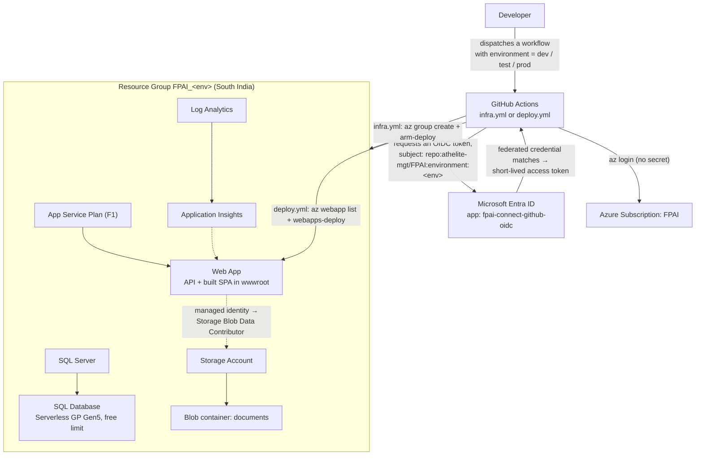

# Deploying FPAI Connect to Azure

This folder holds [main.bicep](main.bicep), the template that provisions everything FPAI Connect
needs to run in Azure. It's deployed by two separate GitHub Actions workflows — one that stands
up infrastructure, one that ships app code — both authenticating via OIDC, no client secret or
publish profile stored anywhere in GitHub.

## How a deploy actually happens



`infra.yml` creates/updates the resource group and everything inside it. `deploy.yml` assumes
that resource group already exists, looks up the web app's name inside it, and pushes a fresh
build. Running `infra.yml` again later (e.g. to pick up a Bicep change) is safe — it's an
idempotent `az deployment group create`, not a teardown-and-recreate.

## Resources this template creates

| Resource | SKU / tier | Why |
|---|---|---|
| App Service Plan + Web App | Linux, **F1 (free)** | Hosts the API and serves the built SPA from `wwwroot`; health check on `/api/health` |
| SQL Server + Database | Serverless **General Purpose, Gen5, up to 2 vCores**, `useFreeLimit: true` | The backend has no workload heavy enough to need more; this SKU qualifies for Azure SQL's free monthly limit (one per subscription) |
| Storage Account + `documents` blob container | `Standard_LRS`, TLS 1.2, no public blob access | Document storage — App Service's local disk is ephemeral and not shared between instances |
| Log Analytics Workspace + Application Insights | `PerGB2018`, 30-day retention | Diagnostics and request telemetry |

Nothing here needs a Key Vault or an email/SMTP resource — see the root [README](../README.md#known-gaps)'s "Known gaps" for what the backend genuinely doesn't use.

## Passwordless where it's easy, not where it's hard

The Web App gets a **system-assigned managed identity**, granted `Storage Blob Data Contributor`
on the storage account by this template (see `storageBlobRoleAssignment` in `main.bicep`) — so
document storage needs no account key anywhere, ever.

SQL Server still uses an admin login/password (`sqlAdminLogin`/`sqlAdminPassword`, passed as
secrets — see below). Making SQL passwordless too is possible but needs a deployment script to
run `CREATE USER ... FROM EXTERNAL PROVIDER` plus extra Entra permissions on whoever runs it —
judged not worth the added moving parts for this app's scale. The manual, one-time steps to do
it anyway are documented in the root [README](../README.md).

## Naming and tagging

Every environment gets its own resource group, **`FPAI_<env>`** (`FPAI_dev`, `FPAI_test`,
`FPAI_prod`) — not a shared one — so resources for different environments can never collide or
get mixed up in the portal.

Every resource name includes the environment, e.g. `fpai-connect-prod-<uniqueSuffix>` (Web App),
`fpai-connect-sql-prod-<uniqueSuffix>` (SQL Server), `fpai-connect-db-prod` (Database),
`fpai-connect-plan-prod` (App Service Plan). The one exception is the **storage account**: Azure
storage account names are capped at 24 characters, lowercase letters/numbers only, and must be
globally unique across *all* of Azure — not just this subscription — so the template keeps the
env fully legible (`prod`/`test`/`dev`) but truncates the `appName` portion to 6 characters
rather than risk truncating the hash that actually guarantees uniqueness.

A handful of child/config resources keep fixed, platform- or convention-mandated names that
can't (or shouldn't) carry the environment or a tag: the storage account's `default` blob
service, its `documents` container (the backend's `Storage:ContainerName` default), the SQL
firewall rule `AllowAllWindowsAzureIps`, the Web App's `appsettings` config slot, and the blob
role assignment (Azure requires role assignment names to be GUIDs).

Every resource that *does* support ARM tags carries the same four:

```
env: <dev|test|prod>
region: <the deployment region>
subscription: <subscription id>
githubRepo: athelite-mgt/FPAI
```

The resource group itself is tagged the same way by `infra.yml`'s `az group create --tags`
step, since Bicep can't tag the resource group it's deploying into.

## Authentication: GitHub OIDC → Azure

No `AZURE_CREDENTIALS` client secret, no publish profile. Both workflows federate a short-lived
Azure AD token off the GitHub Actions OIDC token, scoped to the **GitHub Environment** matching
whichever `environment` input was chosen — never to a branch. That means every environment you
dispatch against (`dev`, `test`, `prod`) needs its own GitHub Environment *and* its own
federated credential with a matching subject:

```
repo:athelite-mgt/FPAI:environment:<env>
```

One-time setup (already done for `dev`/`test`/`prod` as of writing):

```bash
az ad app create --display-name "fpai-connect-github-oidc"
az ad sp create --id <appId>

for env in dev test prod; do
  az ad app federated-credential create --id <appId> --parameters "{
    \"name\": \"fpai-${env}-environment\",
    \"issuer\": \"https://token.actions.githubusercontent.com\",
    \"subject\": \"repo:athelite-mgt/FPAI:environment:${env}\",
    \"audiences\": [\"api://AzureADTokenExchange\"]
  }"
done

az role assignment create --assignee <appId> --role Contributor --scope /subscriptions/<sub-id>
az role assignment create --assignee <appId> --role "Role Based Access Control Administrator" --scope /subscriptions/<sub-id>
```

`Contributor` lets the workflow create the resource group and everything in it; `Role Based
Access Control Administrator` is what lets the template's own `storageBlobRoleAssignment`
resource succeed — plain `Contributor` deliberately excludes
`Microsoft.Authorization/roleAssignments/write`.

## Repository configuration the workflows expect

**Variables** (not secret — safe to read, so they're variables rather than secrets):
`AZURE_CLIENT_ID`, `AZURE_TENANT_ID`, `AZURE_SUBSCRIPTION_ID`, `GOOGLE_CLIENT_ID`,
`MICROSOFT_CLIENT_ID` — the last two are public OAuth client ids that also ship inside the
frontend bundle, so there's nothing gained by treating them as secrets.

**Secrets**: `SQL_ADMIN_LOGIN`, `SQL_ADMIN_PASSWORD`, `JWT_SIGNING_KEY`.

## Bicep parameters

| Parameter | Default | Notes |
|---|---|---|
| `appName` | `fpai-connect` | Seeds every resource name; 3–18 chars |
| `location` | `resourceGroup().location` | Inherits South India from the RG |
| `environmentName` | *(required)* | `dev` \| `test` \| `prod` — passed from the workflow input |
| `sqlAdminLogin` / `sqlAdminPassword` | *(required)* | From `SQL_ADMIN_LOGIN` / `SQL_ADMIN_PASSWORD` secrets |
| `jwtSigningKey` | *(required)*, ≥32 chars | From the `JWT_SIGNING_KEY` secret |
| `googleClientId` / `microsoftClientId` | `''` | Optional — sign-in for that provider stays off until set |
| `appServiceSku` | `F1` | `F1`\|`B1`\|`B2`\|`S1`\|`P0v3`\|`P1v3` |

## Running it yourself

Prefer dispatching the **Provision Azure Infrastructure** and **Deploy to Azure** GitHub Actions
workflows (Actions tab → pick the workflow → Run workflow → choose an environment). To validate
a template change locally without creating anything, `az deployment group what-if` is a safe,
read-only dry run:

```bash
az deployment group what-if \
  --resource-group FPAI_dev \
  --template-file deploy/main.bicep \
  --parameters environmentName=dev sqlAdminLogin=... sqlAdminPassword=... jwtSigningKey=...
```
